# Pairline Architecture

This document describes the architecture of the Pairline anonymous chat platform. It covers the service topology, data flow, WebRTC/TURN infrastructure, matchmaking lifecycle, moderation pipeline, and deployment model.

For environment variable reference, see [ENVIRONMENT.md](./ENVIRONMENT.md). For TURN-specific details, see [TURNSERVER.md](./TURNSERVER.md). For auto-moderation, see [MODERATION.md](./MODERATION.md).

---

## High-Level Topology

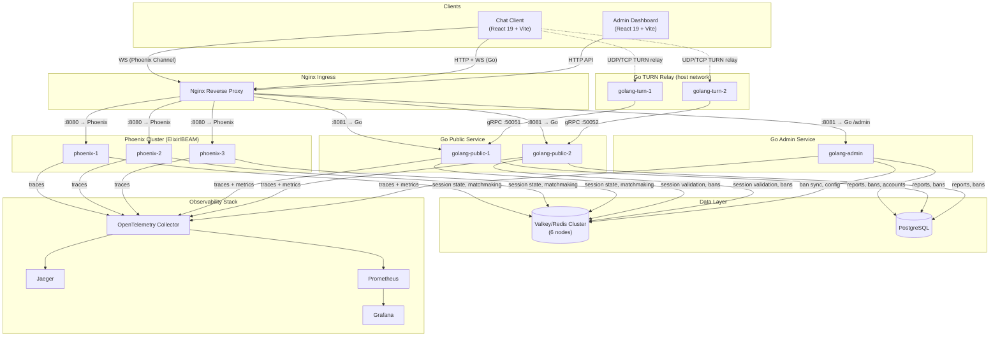

---

## Service Responsibilities

| Service | Owner | Responsibilities |
|---------|-------|-----------------|
| **Phoenix** | Elixir/BEAM | WebSocket sessions, matchmaking, session lifecycle, IP tracking, Turnstile verification, BEAM clustering |
| **Go Public** | Go | WebRTC signaling WS, TURN bootstrap, report submission, ban enforcement (Redis), gRPC TURN control plane |
| **Go Admin** | Go | Admin dashboard API, JWT auth, ban CRUD, report review, auto-moderation worker, infra health aggregation |
| **Go TURN** | Go (Pion) | TURN/STUN relay (UDP/TCP/TLS), allocation management, session validation via gRPC |
| **Redis/Valkey** | — | Session state, match state, ban cache, pub/sub coordination, queue shards |
| **PostgreSQL** | — | Reports, bans, admin accounts, banned words, bot definitions, auto-moderation settings |

---

## Data Flow: Chat Session Lifecycle

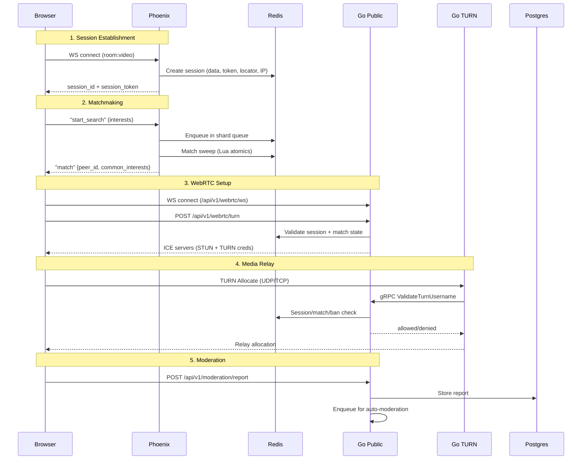

---

## TURN Control Plane

The TURN relay runs as a standalone process on host networking. Instead of reading Redis directly, it validates sessions through a gRPC control-plane API hosted by the Go public service.

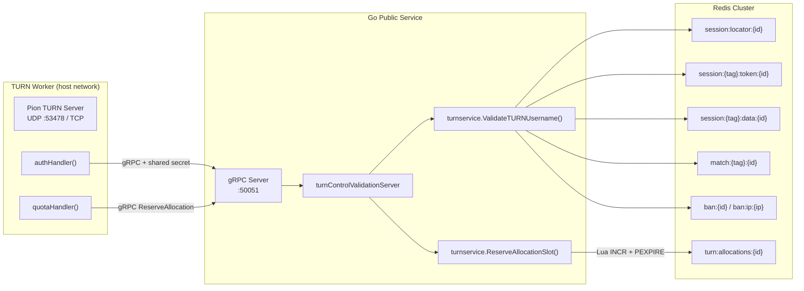

### TURN Auth Flow

1. Browser sends TURN `Allocate` request with username `{session_id}|{sha256(token)}`
2. Pion calls `authHandler` → gRPC `ValidateTurnUsername` to Go public service
3. Go public validates: session exists → token matches → session active → not banned → currently matched → peer reciprocates
4. On success, Pion calls `quotaHandler` → gRPC `ReserveAllocation` with per-session limit
5. Allocation counter is managed via atomic Lua script with 24h safety TTL
6. On allocation teardown, `OnAllocationDeleted` callback releases the slot

---

## Matchmaking Architecture

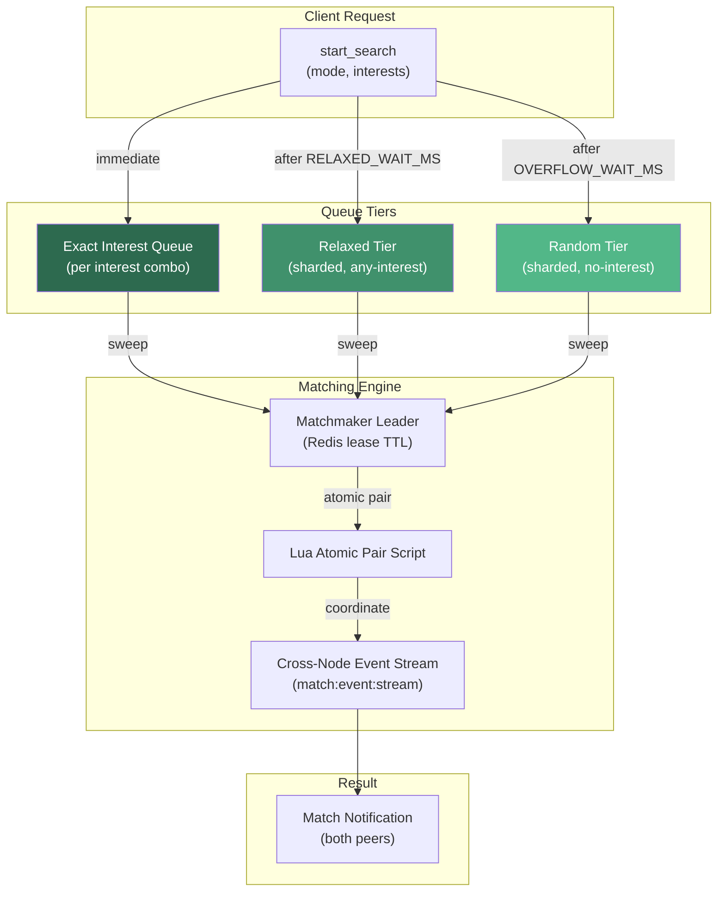

### Queue Shard Design

- Queues are sharded by mode (lobby/text/video) across `MATCH_SHARD_COUNT` Redis hash slots
- Interest-based matching checks exact interest buckets first
- Sessions fall through tiers over time: exact → relaxed → random
- Cross-shard matchmaking uses a normalized queue shard so sessions across the cluster can discover each other
- Match pairing is atomic via Lua scripts to prevent double-matching

---

## Moderation Pipeline

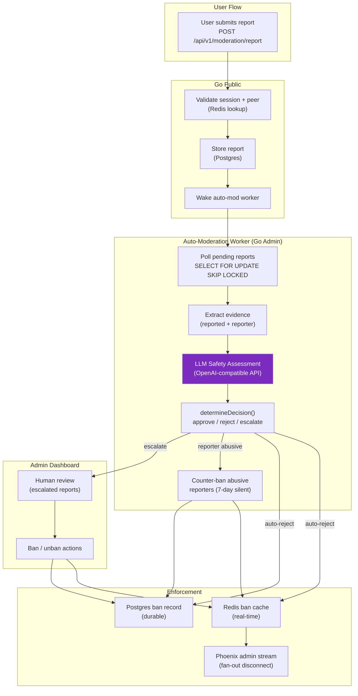

---

## Bot System

Bots are managed by Phoenix and run as supervised GenServer processes under `OmeglePhoenix.Bots.Supervisor`. They are assigned to waiting sessions based on admin-configured definitions stored in Redis. There are two bot types:

| Type | Worker | How it generates replies |
|------|--------|------------------------|
| **Engagement** | `ScriptWorker` | JSON-scripted messages with trigger/regex matching, opening/closing/fallback messages |
| **AI** | `AIWorker` | LLM-backed via LangChain (`ChatOpenAI`), per-definition API endpoint/model/system prompt |

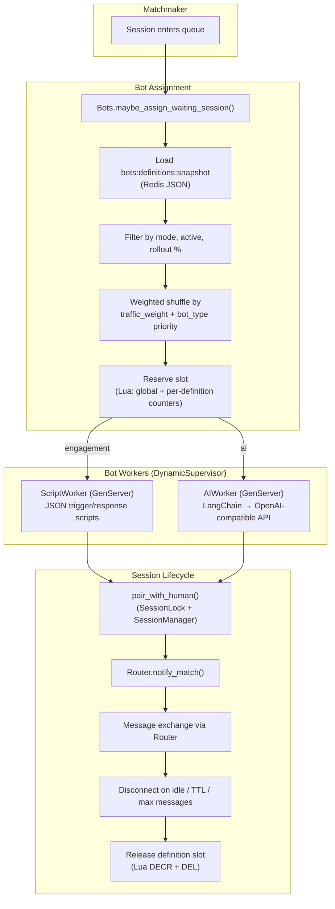

### Bot Capacity Management

Slot reservation uses a two-key Lua script with `{bot-active-runs}` hash tag:
- `bots:active_runs:{bot-active-runs}:global` — global concurrent run counter
- `bots:active_runs:{bot-active-runs}:definition:{id}` — per-definition counter

Both keys have a safety TTL derived from `session_ttl_seconds + 60s`. The hash tag ensures both keys land on the same Redis cluster slot for atomic Lua execution.

### Bot Admin Management

Bot definitions are managed through the admin dashboard (Go admin API → Postgres) and published as a JSON snapshot to Redis (`bots:definitions:snapshot`). The Go admin also serves a CRUD API for bot definitions, AI config, and engagement scripts.

---

## Cluster-Aware Session Router

The `OmeglePhoenix.Router` module handles cross-node message delivery in a multi-node Phoenix cluster. It uses a combination of local ETS lookup and Redis-backed owner records.

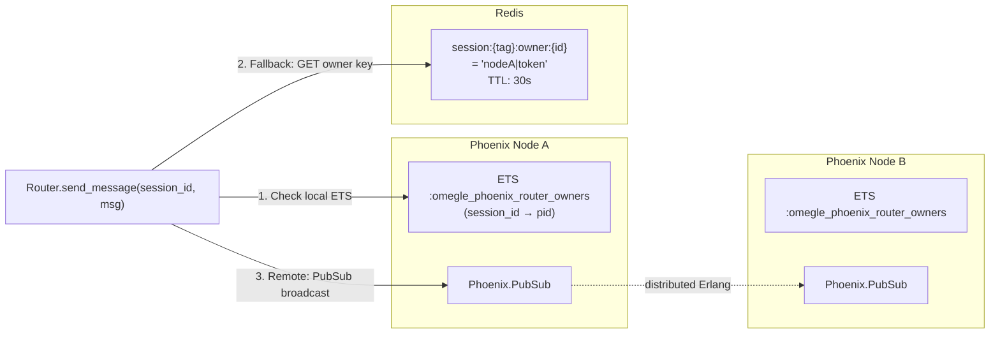

**Delivery strategy:**
1. Check local ETS for a live `pid` — if found, deliver directly via `send/2`
2. If not local, read the Redis owner key to find which node owns the session
3. If the owner is a remote connected node, broadcast via `Phoenix.PubSub`
4. Owner records use compare-and-delete Lua scripts to prevent stale cleanup races

---

## Real-Time Banned-Word Filter

`MessageModeration` is a GenServer that periodically syncs the banned-word set from Redis into `persistent_term` for zero-cost reads on the hot path.

- Source: `moderation:banned_words` (Redis SET), managed by admin dashboard
- Toggle: `moderation:banned_words:enabled` (Redis key)
- Refresh: every 30 seconds
- Matching: tokenized n-gram phrase matching (multi-word phrases supported)
- Used by `RoomChannel` to silently block messages containing banned phrases

---

## Reaper (Orphan Cleanup)

The `Reaper` is a leader-elected GenServer that periodically scans for stale state:

1. **Orphaned sessions** — entries in `sessions:active` (Redis SET) whose session data no longer exists
2. **Stale queue entries** — sessions in matchmaking queues that are no longer in `:waiting` status

Leader election uses `SET NX PX` on `reaper:leader` with a 5s TTL, renewed in a background process. Only one node reaps at a time across the cluster.

---

## Elixir OTP Supervision Tree

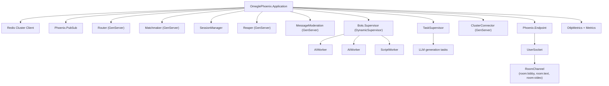

---

## Frontend Architecture

### Chat Client (`frontend/client`)

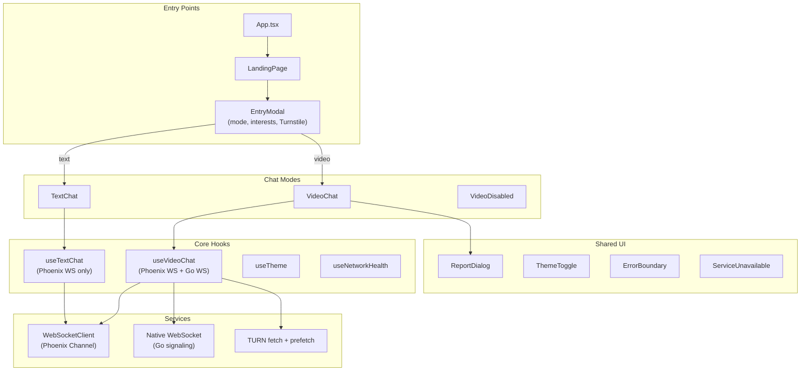

### Admin Dashboard (`frontend/admin`)

The admin dashboard is a single-page React app (`AdminPanelRuntime.tsx`, 250KB+) that communicates exclusively with the Go admin API via JWT-authenticated REST calls.

**Tabs / Features:**
- Reports queue with auto-moderation verdicts
- Ban management (session + IP bans, temporary/permanent)
- Banned words CRUD with toggle
- Bot definitions management (engagement scripts + AI config)
- Infrastructure health dashboard (Phoenix + Go + TURN node status)
- Admin user management

---

## Go Binary Capabilities

The Go service compiles into multiple binaries with different capability sets:

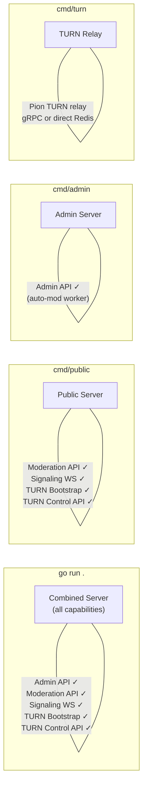

| Capability | `go run .` | `cmd/public` | `cmd/admin` | `cmd/turn` |
|-----------|:---:|:---:|:---:|:---:|
| Admin API | ✓ | | ✓ | |
| Moderation API | ✓ | ✓ | | |
| Signaling WS | ✓ | ✓ | | |
| TURN Bootstrap | ✓ | ✓ | | |
| TURN Control gRPC | ✓ | ✓ | | |
| TURN Relay | | | | ✓ |
| Auto-mod Worker | ✓ | ✓ | ✓ | |
| Ban Sync Loop | ✓ | ✓ | ✓ | |

---

## Redis Key Topology

All session-scoped keys use `{mode:shard}` hash tags to ensure co-location on the same Redis cluster slot.

| Key Pattern | Owner | TTL | Purpose |
|-------------|-------|-----|---------|
| `session:locator:{id}` | Phoenix | session TTL | Maps session ID → `mode\|shard` route |
| `session:{mode:shard}:data:{id}` | Phoenix | session TTL | Session metadata (interests, config) |
| `session:{mode:shard}:token:{id}` | Phoenix | session TTL | SHA-256 of session token |
| `session:{mode:shard}:ip:{id}` | Phoenix | session TTL | Client IP for ban checks |
| `session:{mode:shard}:owner:{id}` | Phoenix | 30s lease | Which Phoenix node owns this session |
| `match:{mode:shard}:{id}` | Phoenix | — | Current match peer ID |
| `ban:{session_id}` | Go | ban duration | Active session ban |
| `ban:ip:{address}` | Go | ban duration | Active IP ban |
| `bans:index` | Go | — | Set of all active ban keys |
| `turn:allocations:{session_id}` | Go | 24h safety | TURN allocation counter per session |
| `webrtc:{mode:shard}:ready:{id}` | Phoenix | — | WebRTC readiness flag |
| `webrtc:turn:cache:cloudflare:{user}` | Go | 10min | Cached Cloudflare TURN credentials |

---

## Docker Cluster Layout

### Default Local Dev (`docker-compose.yml`)

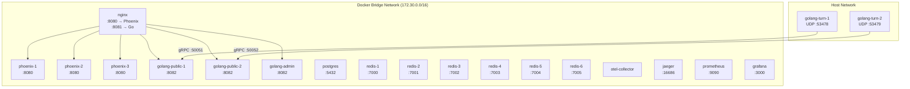

### Elixir Cluster Compose (`elixir-cluster-compose.yml`)

Production-like layout (gitignored, contains secrets). Same topology as default but with:
- Real CORS origins and secrets
- `TURN_PUBLIC_IP` set to the host's LAN IP
- BEAM node clustering enabled across Phoenix instances
- Host-specific Redis passwords

---

## Network Ports (Default Dev)

| Port | Service | Protocol | Exposed |
|------|---------|----------|---------|
| 5173 | Chat Frontend | HTTP | localhost |
| 5174 | Admin Frontend | HTTP | localhost |
| 8080 | Phoenix (direct) / Nginx→Phoenix | HTTP+WS | localhost |
| 8081 | Nginx→Go | HTTP | localhost |
| 8082 | Go Combined (direct) | HTTP+WS | localhost |
| 7000–7005 | Redis Cluster | TCP | localhost |
| 5432 | PostgreSQL | TCP | localhost |
| 50051–50052 | TURN Control gRPC | TCP | internal |
| 53478–53479 | TURN Relay | UDP+TCP | host network |
| 16686 | Jaeger UI | HTTP | localhost |
| 9090 | Prometheus | HTTP | localhost |
| 3000 | Grafana | HTTP | localhost |
| 4317–4318 | OTEL Collector | gRPC+HTTP | internal |

---

## Cross-Service Auth

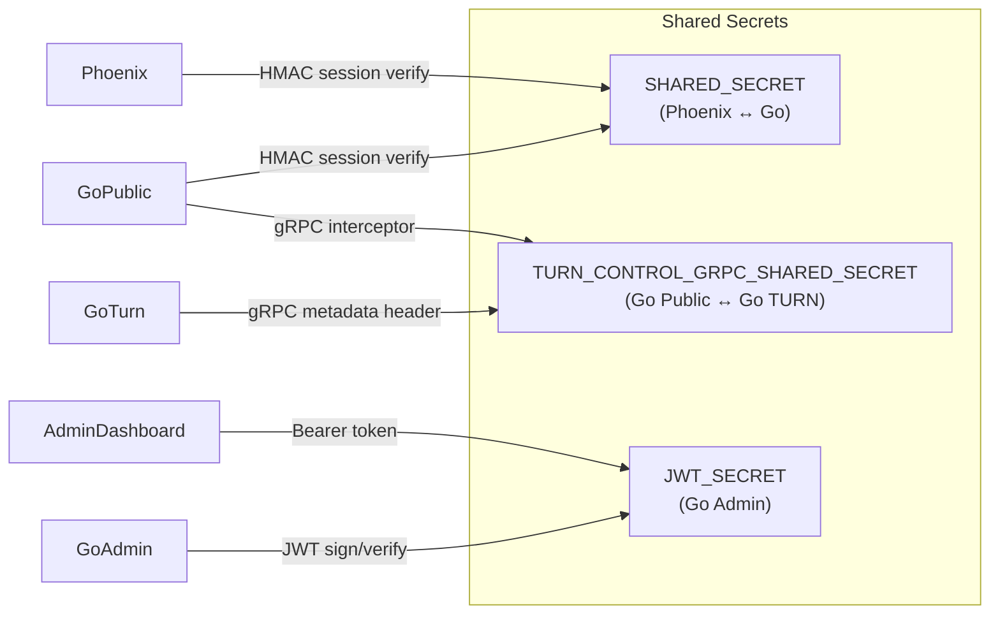

| Boundary | Mechanism | Notes |
|----------|-----------|-------|
| Phoenix ↔ Go | `SHARED_SECRET` HMAC | Used in session token verification |
| Go Public ↔ Go TURN | gRPC metadata + constant-time compare | `x-pairline-turn-control-auth` header |
| Admin Dashboard ↔ Go Admin | JWT (access + refresh) | CSRF double-submit cookie + origin check |
| Browser → TURN | TURN long-term credential | Username = `{session_id}\|{sha256(token)}`, password = `TURN_STATIC_AUTH_SECRET` |
