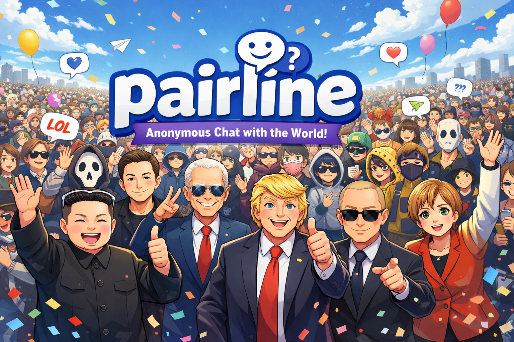

# Pairline



Anonymous text and video chat app with moderation tooling. Built for massive scale with true concurrency.

## Stack

- [frontend/](./frontend): React 19 + Vite
- [backend/elixir/omegle_phoenix/](./backend/elixir/omegle_phoenix): Phoenix websocket and matchmaking service
- [backend/golang/](./backend/golang): moderation, admin, and TURN service
- Redis: session state and admin pub/sub
- PostgreSQL: reports, bans, and admin data

## Repo layout

```text
.
├── frontend/
├── backend/
│   ├── elixir/omegle_phoenix/
│   └── golang/
├── docker-compose.yml
├── SETUP.md
└── Vulnerabilities.md
```

## Getting started

See [SETUP.md](./SETUP.md) for local setup, environment variables, and run commands.

## Service overview

Phoenix handles websocket sessions, matchmaking, and session IP tracking. The Go service handles report submission, admin APIs, ban persistence, and TURN credential generation. The frontend talks to both services: websocket traffic goes to Phoenix and HTTP moderation/admin traffic goes to Go.

## Notes

- The default local ports are `5173` for the frontend, `8080` for Phoenix, and `8082` for the Go service.
- `docker compose up -d redis postgres` starts the local data services.
- `SHARED_SECRET` must match across the backend services.

## Why Pairline Scales


... Any Problem?
Scale it up to half of the planet IDC. But be ethical.
Pairline leverages Elixir's battle-tested concurrency model and Go's lightweight goroutines to handle massive concurrent connections. Two of every connection, all day, every day.

## Additional docs

- [frontend/README.md](./frontend/README.md)
- [backend/elixir/omegle_phoenix/README.md](./backend/elixir/omegle_phoenix/README.md)
- [backend/golang/README.md](./backend/golang/README.md)

## Known Bugs
- Using Turn sometimes skips first entry while starting video streams.
- Could have additional bugs and issues as it is beta. Use at your own risk. Audit code by yourself.

Keywords: omegle clone github, random video chat app, omegle alternative, open source video chat, webrtc video chat, omegle like, omegle clone, random video chat, omegle alternative, open source omegle, video chat app, random chat application, webrtc video chat, react video chat, omegle like app github, video chat github, omegle clone github, random video chat open source